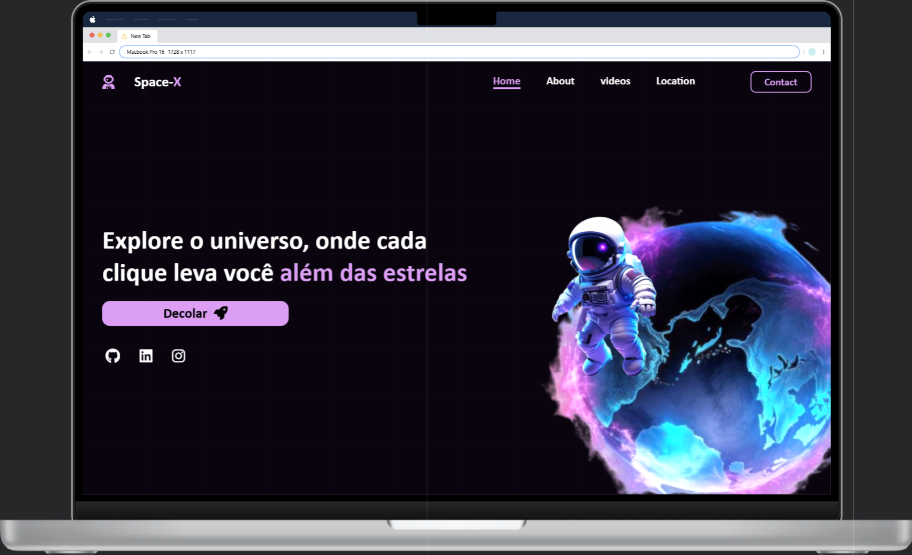

# 🚀 Space-X | Landing Page Galáctica

### 🌌 Explore o universo, onde cada clique leva você além das estrelas.

---

## 📸 Preview



---

## 🧠 Sobre o Projeto

Este é um projeto de uma **landing page com tema espacial**, desenvolvido com foco em **design moderno, animações suaves e responsividade**. A ideia é transportar o usuário para uma experiência visual imersiva ao navegar por um universo fictício.

---

## 🔧 Tecnologias Utilizadas

- **HTML5**
- **CSS3 (com variáveis e animações)**
- **JavaScript (efeitos de background)**
- **Font Awesome (ícones espaciais)**
- **Responsividade com `clamp()` e `flex/grid`**

---

## 📂 Estrutura de pastas

```
├── index.html
├── README.md
├── src
│   ├── style
│   │   └── index.css
│   ├── javascript
│   │   └── backgroud.js
│   └── images
│       ├── planeta.png
│       ├── astronauta.png
│       └── preview.png
```

---

## 🎯 Funcionalidades

- Animação de plano de fundo interativo com `hover`
- Navegação com hover suave e links estilizados
- Astronauta e planeta com animações contínuas
- Ícone de foguete que reage ao passar o mouse
- Totalmente responsivo para diferentes tamanhos de tela

---

## 💡 Melhorias futuras

- Versão em inglês com botão de troca de idioma
- Adição de vídeos espaciais e seções sobre planetas
- Integração com formulário de contato ou envio por e-mail
- Efeitos sonoros galácticos 👨‍🚀🎵

---

## 📬 Contato

Desenvolvido por [Carlos Eduardo](https://www.linkedin.com/in/carlos-eduardo-da-silva-5b157334b/)  
GitHub: [@Carlos728293](https://github.com/Carlos728293)
